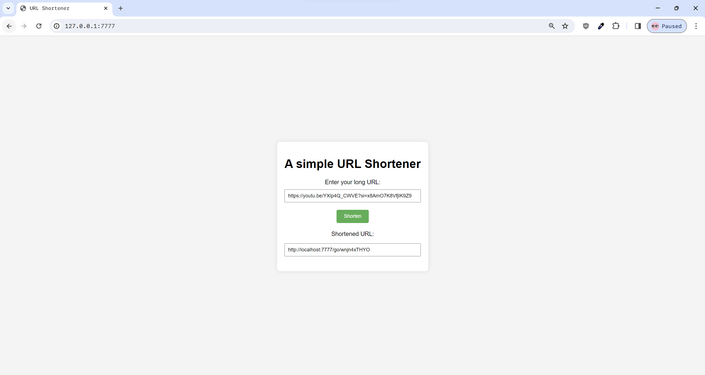
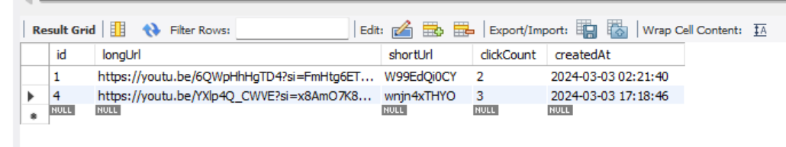

# urlshortener

### A very very simple URL shortener inspired from `<System Design Interview>`

### Appearances

### Mechanism
1. Do SHA256 hash URL
2. Encode hashed URL to BASE62 encoding
3. Cut the first 10 characters. The duplication probability is **1/62^10** = 1/839,299,365,868,340,224. The url will be like `W99EdQi0CY`
4. Save that to the database and return the shortened URL to the user after appending the site domain like `knig.ht/W99EdQi0CY`. (Refer to `.env` file.)

It's a very simple and rough implementation, I just built it in only 3 hours. Of course, not for real production!